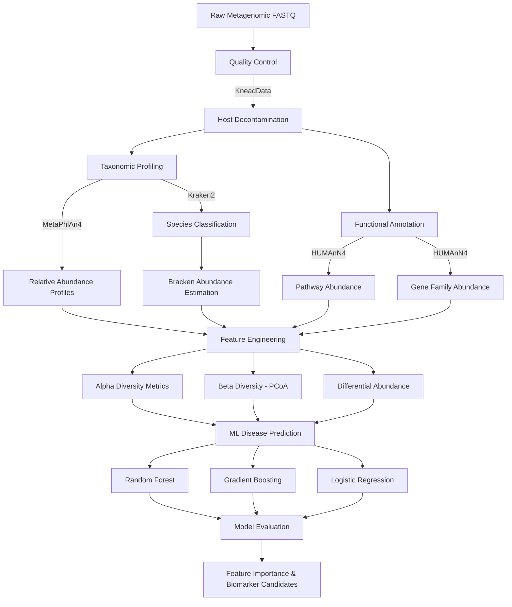

# 🦠 Microbiome Disease Association Pipeline


**An analysis pipeline for taxonomic profiling and functional annotation of human microbiome data, with ML-based disease prediction from metagenomic features.**

---

## Overview

The human microbiome is increasingly recognized as a key factor in disease risk, treatment response, and overall health. This pipeline takes raw metagenomic sequencing data and transforms it into actionable disease association insights through a three-stage process: taxonomic profiling, functional annotation, and machine learning.

### What This Pipeline Does

1. **Taxonomic Profiling** — Identifies which microbial species are present and at what abundance using Kraken2 and MetaPhlAn4
2. **Functional Annotation** — Determines what metabolic pathways those microbes encode using HUMAnN4
3. **Disease Prediction** — Builds ML models that predict disease status from microbial composition and function

### Why This Matters

Microbiome-based diagnostics and therapeutics are a rapidly growing area of precision medicine. Understanding which microbial signatures associate with disease states enables biomarker discovery, patient stratification, and eventually personalized interventions.

---

## Architecture



---

## Roadmap

- [x] **Phase 1** — Project Setup & Data Acquisition
  - [x] Repository structure and documentation
  - [x] Tool installation scripts (Kraken2, MetaPhlAn4, HUMAnN3)
  - [ ] Download reference databases (Kraken2 standard DB, MetaPhlAn4 DB)
  - [ ] Sample dataset selection and download
- [ ] **Phase 2** — Quality Control & Preprocessing
  - [ ] Read QC with FASTQC
  - [ ] Host DNA removal with KneadData
  - [ ] Quality filtering and adapter trimming
- [ ] **Phase 3** — Taxonomic Profiling
  - [ ] Kraken2 classification + Bracken abundance estimation
  - [ ] MetaPhlAn4 profiling for species-level abundances
  - [ ] Taxonomic summary tables and visualization
- [ ] **Phase 4** — Functional Annotation
  - [ ] HUMAnN4 pathway and gene family quantification
  - [ ] Pathway abundance normalization
  - [ ] Functional diversity metrics
- [ ] **Phase 5** — Feature Engineering & ML
  - [ ] Alpha diversity (Shannon, Simpson, Chao1)
  - [ ] Beta diversity (Bray-Curtis, UniFrac via PCoA)
  - [ ] Differential abundance testing (ALDEx2/ANCOM-BC approach)
  - [ ] ML model training with cross-validation
  - [ ] Feature importance and biomarker ranking
- [ ] **Phase 6** — Visualization & Reporting
  - [ ] Taxonomic bar plots and heatmaps
  - [ ] PCoA ordination plots
  - [ ] ROC curves and model comparison
  - [ ] Final report generation

---

## Installation

### Prerequisites

- Python 3.11+
- Conda (recommended for bioinformatics tool management)

### From Source

```bash
git clone https://github.com/jmatos10/microbiome-disease-pipeline.git
cd microbiome-disease-pipeline
pip install -r requirements.txt
```

### Bioinformatics Tools

```bash
# Create conda environment with all bioinfo dependencies
conda create -n microbiome python=3.11
conda activate microbiome

# Core profiling tools
conda install -c bioconda kraken2 bracken metaphlan humann kneaddata

# Install pipeline requirements
pip install -r requirements.txt
```

### Database Setup

```bash
# Kraken2 standard database (~50GB)
kraken2-build --standard --db databases/kraken2_standard

# MetaPhlAn4 database
metaphlan --install --bowtie2db databases/metaphlan4

# HUMAnN4 databases
humann_databases --download chocophlan full databases/humann4
humann_databases --download uniref uniref90_diamond databases/humann4
```

---

## Quick Start

```python
# Run taxonomic profiling on a sample
from src.profiling import run_kraken2, run_metaphlan

# Kraken2 classification
kraken_results = run_kraken2(
    fastq="data/raw/sample_001.fastq.gz",
    database="databases/kraken2_standard/",
    output_dir="data/processed/kraken2/"
)

# MetaPhlAn4 profiling
abundance_profile = run_metaphlan(
    fastq="data/raw/sample_001.fastq.gz",
    output_dir="data/processed/metaphlan/"
)
```

```bash
# Command-line usage
python src/profiling/run_kraken2.py \
    --input data/raw/sample_001.fastq.gz \
    --database databases/kraken2_standard/ \
    --output data/processed/kraken2/
```

---

## Project Structure

```
microbiome-disease-pipeline/
├── src/
│   ├── __init__.py
│   ├── preprocessing/         # QC and host decontamination
│   │   ├── __init__.py
│   │   ├── qc.py             # FASTQC wrapper
│   │   └── kneaddata.py      # Host DNA removal
│   ├── profiling/             # Taxonomic classification
│   │   ├── __init__.py
│   │   ├── run_kraken2.py    # Kraken2 + Bracken
│   │   └── run_metaphlan.py  # MetaPhlAn4 profiling
│   ├── functional/            # Pathway annotation
│   │   ├── __init__.py
│   │   └── run_humann.py     # HUMAnN4 pipeline
│   ├── features/              # Feature engineering
│   │   ├── __init__.py
│   │   ├── diversity.py      # Alpha & beta diversity
│   │   └── differential.py   # Differential abundance
│   ├── ml/                    # Disease prediction models
│   │   ├── __init__.py
│   │   ├── train.py          # Model training pipeline
│   │   └── evaluate.py       # Evaluation and reporting
│   └── utils/
│       ├── __init__.py
│       └── viz.py            # Plotting utilities
├── configs/
│   ├── pipeline_config.yaml
│   └── sample_manifest.csv
├── notebooks/
│   ├── 01_taxonomic_eda.ipynb
│   ├── 02_functional_analysis.ipynb
│   └── 03_ml_modeling.ipynb
├── tests/
│   ├── __init__.py
│   └── test_diversity.py
├── docs/
│   └── tool_comparison.md
├── requirements.txt
├── setup.cfg
├── .gitignore
├── LICENSE
└── README.md
```

---

## Tech Stack

| Category | Tools |
|----------|-------|
| Language | Python 3.11 |
| Taxonomic Profiling | Kraken2, Bracken, MetaPhlAn4 |
| Functional Annotation | HUMAnN4, ChocoPhlAn, UniRef90 |
| Preprocessing | KneadData, FASTQC, Trimmomatic |
| Data Processing | pandas, NumPy, SciPy |
| ML/Statistics | scikit-learn, statsmodels |
| Visualization | matplotlib, seaborn |
| Pipeline | Snakemake (planned) |

---

## Contributing

Contributions are welcome! See [CONTRIBUTING.md](CONTRIBUTING.md) for guidelines.

---

## License

MIT License — see [LICENSE](LICENSE) for details.

---

## Author

**Juan Andrés Matos Muñoz**
M.S. Candidate, Translational Research & Applied Medicine — Stanford School of Medicine
[github.com/jmatos10](https://github.com/jmatos10) · [linkedin.com/in/juanmatos10](https://linkedin.com/in/juanmatos10)
